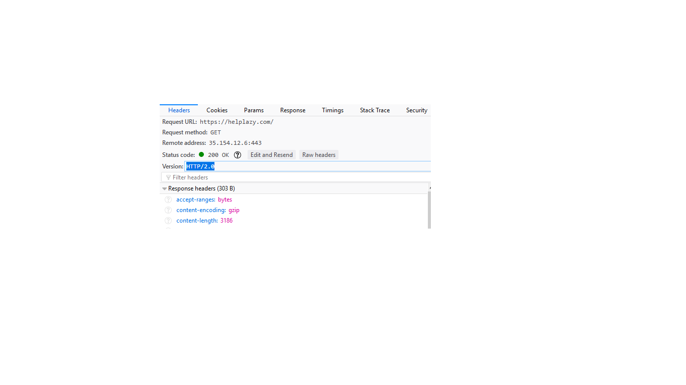

## How to Enable HTTP/2 in Apache 2.4 on Ubuntu 16.04

> Why HTTP/2? As a protocol, HTTP/2 has a clear and simple purpose: to make the Internet better for everyone. It does this by improving on the technical shortcomings of HTTP/1.1, and it also adds new features like multiplexed TCP streams and Server Push. If you would like to know how exactly HTTP/2 makes the Internet better, then read “http2 explained”, a definitive paper written by Daniel Steinberg of Mozilla.

### Requirements

> A self-managed VPS or dedicated server with Ubuntu 16.04 running Apache 2.4.xx. We recommend Vultr because that’s what this site uses. Disclosure: TechWombat earns a commission when you sign up with this link.

> A registered domain name with HTTPS (TLS/SSL). HTTP/2 only works alongside HTTPS because most browsers, including Firefox and Chrome, don’t support HTTP/2 in cleartext (non-TLS) mode.

### Step 1: Upgrade Apache from PPA

Let’s assume you installed Apache from the standard stable Ubuntu repository using apt. When you check your version of apache2 by typing:

```
apache2 -v
```

> … You’ll notice that Apache 2.4.18 is the current default version for Ubuntu 16.04. However, you need Apache 2.4.24 or later for compatibility with HTTP/2.

To get a newer version of Apache, you can use the PPA from Ondřej Surý which includes the latest stable release (Apache 2.4.27 at time of writing). Ondřej is a prominent PHP developer in the Debian community, so this PPA is considered safe.

> To add the PPA, type:
```
sudo add-apt-repository ppa:ondrej/apache2
```

> Or, you can add the PPA manually by inserting these lines into /etc/apt/sources.list:
```
deb http://ppa.launchpad.net/ondrej/apache2/ubuntu xenial main 
deb-src http://ppa.launchpad.net/ondrej/apache2/ubuntu xenial main 
```
> Once the PPA is added, update and upgrade Apache:
```
sudo apt update
sudo apt upgrade
```
> This will update and upgrade apache2 to Apache 2.4.27+.

### Step 2: Tell Apache to use PHP FastCGI
> You want to make Apache use a compatible PHP implementation by changing mod_php to php-fpm (PHP FastCGI). If your website or app breaks on FastCGI, you can always revert back to mod_php until further troubleshooting.

> Install the PHP FastCGI module for PHP 7.0 (replace with “7.1” if desired):
```
sudo apt install php7.0-fpm 
```

> Enable the required modules, proxy_fcgi and setenvif:
```
sudo a2enmod proxy_fcgi setenvif
```

> Enable php7.0-fpm:
```
sudo a2enconf php7.0-fpm 
```
> Disable the mod_php module:
```
sudo a2dismod php7.0 
```

> Restart Apache:
```
sudo service apache2 restart
```

### Step 3: Change MPM from "prefork" to "event"
> Since the default "prefork" MPM (Multi-Processing Module) is not fully compatible with HTTP/2, you’ll need to change Apache’s current MPM to "event" (or "worker"). This is shown by the error message in Apache versions later than 2.4.27 as – AH10034: The mpm module (prefork.c) is not supported by mod_http2.

Keep in mind that your server requires more horsepower for HTTP/2 than for HTTP/1.1, due to multiplexing and other factors. That said, smaller servers with low traffic may not see much difference in performance.

> First, disable the "prefork" MPM:
```
sudo a2dismod mpm_prefork 
```

> Enable the "event" MPM:
```
sudo a2enmod mpm_event 
```

> Restart Apache and PHP 7.0:
```
sudo service apache2 restart 
sudo service php7.0-fpm restart
```

### Step 4: Add a line to your Virtual Host file
> Add the following line to your site’s current Virtual Host config file. This can go anywhere between the <VirtualHost>...</VirtualHost> tags. If you want to serve HTTP/2 for all your sites, add this to your global /etc/apache2/apache2.conf file instead of per each individual site’s Virtual Host file.
```
Protocols h2 h2c http/1.1
```
> Explanation: h2 is TLS-encrypted HTTP/2, h2c is cleartext HTTP/2, and http/1.1 is ordinary HTTP/1.1.

> Having http/1.1 at the end of the line provides a fallback to HTTP/1.1, while h2c is not strictly necessary.

### Step 5: Enable the mod_http2 Apache module
Now you can enable the http2 module in Apache:
```
sudo a2enmod http2
```

> Restart Apache:
```
sudo service apache2 restart
```

### Step 6: Test your Apache server for HTTP/2
> Method 1: "Inspect Element" in browser
Open the developer panel on your web browser by right-clicking anywhere on your website and selecting "Inspect Element" from the context menu.

> Go to the Network tab, and then refresh your browser. You should see all the HTTP requests listed. Click on a request to view raw header information. In the header, you should see "HTTP/2.0" or "h2". Here’s what you will see if it is working correctly:



More information visit [Click](https://techwombat.com/enable-http2-apache-ubuntu-16-04/)